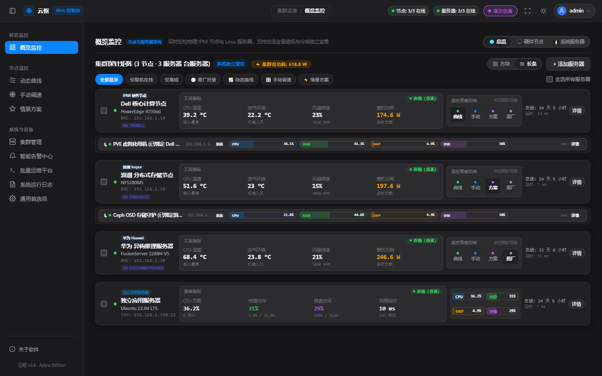
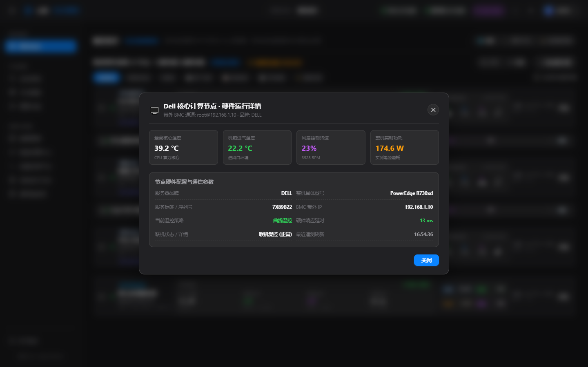
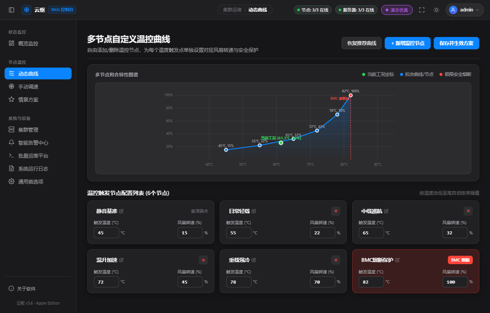
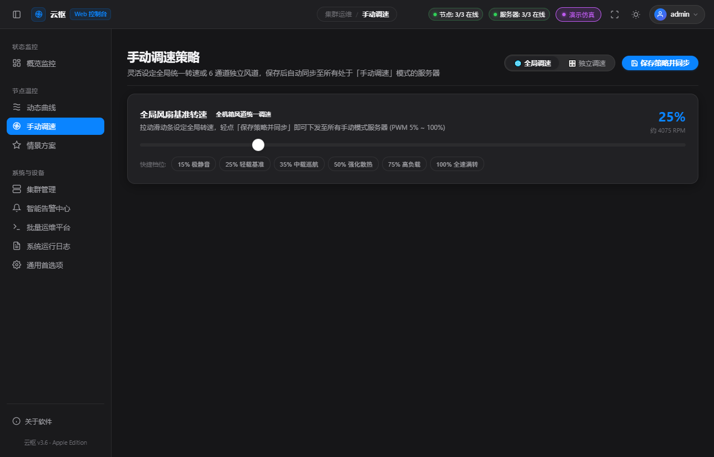

# 云枢 Web 控制中心 (YunShu Web Edition)

<p align="center">
  
</p>

<p align="center">
  <b>专为数据中心、边缘机房与 Homelab 打造的多品牌服务器硬件温控与混合集群运维平台 · 纯 Web & Docker 版</b><br>
  深植 Apple 工业级人机交互设计标准 (HIG) · 兼容 Dell / Inspur / Huawei / Supermicro / Lenovo 全系硬件<br>
  物理 IPMI 带外温控引擎 ╳ 操作系统内核级 SSH 实时探针 ╳ 毫秒级安全超温熔断 ╳ 端到端安全隔离鉴权
</p>

<p align="center">
  <a href="https://hub.docker.com/r/kongbai9420/yunshu-web"></a>
  <a href="https://hub.docker.com/r/kongbai9420/yunshu-web"></a>
  
  
  
  
  
  
</p>

---

## 📖 项目简介与 Web 版演进

**「云枢」(YunShu) Web 版** 是原版云枢架构的重大升级——彻底脱离单机桌面环境与窗口依赖，升级为**面向微型数据中心、私有云算力集群与家庭实验室（Homelab）的标准 Web 控制中心与 Docker 容器镜像**。

无论是在日常主力 PC、Mac、iPad 平板，还是出差在外的手机浏览器中，均可随时随地全功能连接机房，尽享极致丝滑的 Apple 拟态毛玻璃（Liquid Glass）视觉与无延迟监控。

---

> ### 📢 内测阶段重要说明与实测进度看板 (Beta Notice)
> 
> ⚠️ **郑重提示**：本软件目前处于**早期公开内测（Public Beta）阶段**，相关功能正在快速迭代中。由于各品牌服务器 BMC 固件版本、网络环境以及操作系统版本繁杂，**绝大多数功能与跨品牌驱动均需要进行真实环境下的实际上机测试验证**！
> 
> 建议在初期测试调速时，请务必现场观察服务器机箱风噪与核心温度变化，切勿在无人值守生产环境中激进关死风扇。
> 
> ---
> 
> #### 🧪 当前功能与硬件实测状态矩阵：
> 
> | 功能模块 | 对应机型 / 环境 | 测试状态 | 详细说明与实机反馈 |
> | :--- | :--- | :---: | :--- |
> | **物理带外风扇调速** | **Dell PowerEdge T330 (13G 塔式)** | 🟢 **实测完全正常** | iDRAC8 协议通信稳定，单路 CPU 核心温控与风扇手动/曲线调速丝滑，机箱降噪效果显著。 |
> | **整机遥测与降噪** | **Dell PowerEdge R730xd (13G 机架式)** | 🟢 **实测完全正常** | 进气温度、双路 CPU 核心温度与电源功耗读取正常，风扇降噪与 6 通道独立/全局调速稳定。 |
> | **戴尔跨代与 iDRAC9** | **Dell 14G-16G (如 R740/R750/R7515 等)** | 🟡 **代码就绪 / 需注意固件机制** | 详见下方专门的 **《iDRAC9 固件与调速兼容性说明》**，待机友进一步联调实测。 |
> | **多品牌硬件温控** | **浪潮 Inspur / 华为 Huawei / 超微 / 联想** | 🟡 **代码就绪 / 待实测** | 各品牌专属 BMC Raw 指令集与传感器分流层已编写完成，急需真实物理机型联调。 |
> | **系统底层探针** | **Proxmox VE (PVE 7/8) / Debian / Ubuntu / CentOS** | 🟡 **代码就绪 / 待实测** | 基于免 Agent 的 SSH 异步流式采集链路已就绪，高并发巡检与各 Linux 发行版适配待实测。 |
> | **出厂级超温熔断** | **Hardware Safety Guard** | 🟡 **机制就绪 / 待实测** | 当核心温度超过阈值（默认 82℃）自动交还原厂强冷逻辑已就绪，待实机拔线/压测验证熔断响应。 |
> | **远程多渠道告警** | **企业微信 / 钉钉 / 飞书 / Server酱 / Bark / PushPlus** | 🟡 **接口就绪 / 待实测** | 各主流厂商 Webhook 消息组装引擎已接入，待不同网络环境及推送频控实测验证。 |
> 
> 💬 **诚邀测试交流**：目前已验证 **Dell T330** 与 **Dell R730xd** 完美受控！如果您手头有 14 代以上戴尔机型、浪潮或华为服务器，非常欢迎进群协助实测！  
> 🐧 **官方内测交流 QQ 群：`317151818`**（可在群内随时获取最新内测版单文件程序、反馈 Bug 与获取技术协助）

---

### ⚠️ 关于戴尔 14 代及以后（iDRAC9 / 如 R740、R7515 等）的调速与固件机制说明

在 13 代及以前（如 R730xd、T330 搭载 iDRAC8），戴尔开放了直接通过标准 IPMI Raw 裸指令接管风扇的权限；但从 **14G / 15G / 16G（iDRAC9）** 开始，戴尔在固件策略上做了多项安全合规收紧，请相关机友在使用前留意：

1. **禁用第三方 PCIe 疯狂散热响应（最关键的第一步）**：
   - 14 代及以后机型在插入非原厂 PCIe 设备（家用显卡、万兆网卡、M.2 转接卡）时，BMC 往往会强制拉满风扇。请首先通过 iDRAC9 SSH 控制台关闭该限制：
     ```bash
     racadm set system.thermalsettings.ThirdPartyPCIFanResponse 0
     ```
2. **iDRAC9 的固件版本锁定与降级现状**：
   - **早期 14 代机型（如 R740）**：在 `3.30.30.30` 之前的固件中保留了原始 IPMI 调速权限；在升级到 3.34+ 以后官方屏蔽了 `0x30 0x30` 指令。早期机型可以通过官方固件回滚（降级）恢复 IPMI 接管；
   - **较晚推出的 15 代机型（如 R7515、R750 等）**：出厂自带的初始固件版本即高于 3.40（如 3.40.40.40），由于硬件 ID 与签名机制，**此类机型无法跨时代降级到 3.30 以前的老版本**。
3. **iDRAC9 官方受支持的静音优化手段**：
   - 对于无法降级的新版 iDRAC9，建议通过官方合规的 `racadm` 命令调整散热模式与最低风扇转速下限：
     ```bash
     # 设置基础风扇转速下限为 15%~20%
     racadm set system.thermalsettings.MinimumFanSpeed 20
     ```
   - 或在 iDRAC 网页中将散热模式配置为 **`Sound Cap (声学静音优先)`**；
   - 社区亦有针对 iDRAC9 的 OEM 解锁固件可供深度玩法折腾。本项目后续版本将集成针对 iDRAC9 的 racadm / Redfish 原生通道。

---

## 🌟 项目初衷与核心价值

在家庭私有云（Homelab）、小型工作室、影音 NAS 或边缘机房环境中，Dell PowerEdge、浪潮（Inspur）、华为（Huawei）、超微（Supermicro）、联想（Lenovo）等机架式/塔式服务器以高扩展性、出色的冗余设计与极高的性价比，成为了许多机友搭建虚拟化（PVE / ESXi / UNRAID）和轻量微服务的首选利器。

然而，**服务器原厂设计的初衷是服务于恒温专用机房，其默认的 BMC / iDRAC 温控策略极为保守且激进**：
- **痛点一（日常负载极低但风噪极大）**：家庭或个人日常场景下，服务器多数处于低负载或轻量运行状态，整机发热量其实非常有限。但原厂策略往往强制设定了极高的风扇底噪转速（通常在 35%~60% 以上），伴随着高频气流与尖锐啸叫，放在客厅、书房或弱电箱几乎难以忍受；
- **痛点二（插第三方扩展卡触发转速暴走）**：一旦用户自行插入非原厂认证的 PCIe 设备（如家用万兆网卡、固态转接卡、消费级显卡），BMC 会判定进入未知散热环境，直接将风扇拉满至 70%~100% 暴走运转；
- **真实解决方案（10%~30% 黄金静音区间）**：实测表明，在家庭低中负载日常使用中，**通过合理的带外精细化调速，完全可以将风扇转速安全降至 10% ~ 30% 左右**——既能维持充裕的风道风压确保硬件凉爽稳定，又能瞬间将恼人的工业啸叫抑制为几乎不可闻的微弱风声，真正实现低噪静音、安心伴眠的“家庭级静音运行”。

市面上的传统控制脚本大多零碎脆弱，缺乏多品牌统一视盘、缺乏操作系统内核心态联动，更缺乏至关重要的防过热兜底。

**「云枢」(YunShu) Web 版** 正是为此而生：以优雅的 **Apple HIG 工业级人机交互** 为基底，将多品牌带外硬件控制（IPMI 2.0 / DCMI）与操作系统内核心态指标（SSH / Linux / PVE）深度融合，提供兼顾**低噪静音调控、集群巡检、自适应策略及出厂级防过热安全熔断**的一站式开箱即用平台。

---

## ✨ 核心特性

### 1. 纯正 Apple HIG 工业美学（Web 控制台版）
- **深色与浅色双模自适应**：深邃磨砂石墨质感与通透自然光影，支持全局实时平滑切换。
- **全景总览 / 硬件节点 / 系统服务器 三维视界**：顶层单行并列分段器，支持一键切换集群全景透视或专注物理/虚拟层。
- **紧凑方块网格 (Compact Grid) & 贯通长条矩阵 (Compact Row)**：无论窗口如何收缩拉伸，始终保持严密的弹性栅格与无阶跃动画。
- **Web 端体验重构**：移除无意义的原生窗口关闭/缩放把手，引入**侧边栏极简收缩轨**、**HTML5 全屏监控大屏模式**与**动态面包屑胶囊**。

### 2. 多品牌硬件架构深度兼容
- **全系列无缝支持**：
  - 戴尔 **Dell PowerEdge** (12G / 13G / 14G / 15G / 16G 全系 iDRAC 7/8/9)
  - 浪潮 **Inspur** (NF5270 / NF5280 M4/M5/M6 等)
  - 华为 **Huawei** (RH2288 / FusionServer 2288H V3/V5 等 iBMC)
  - 超微 **Supermicro** (X9 / X10 / X11 / H11 / H12 全系 IPMI)
  - 联想 **Lenovo** (ThinkSystem SR650 / RD 系列 TSM/XCC)
- **品牌温控协议自动映射**：自动嗅探服务器品牌型号并适配专属底层控制指令（Raw Byte 命令组精准分发）。

### 3. 四维全时温控策略矩阵
- **动态曲线模式 (Dynamic Curve)**：可视化自由拖拽多段温度-转速拐点。基于实时最高核心温度，毫秒级无级插值调谐转速。
- **全局与独立手动模式 (Manual RPM)**：支持全局多机一键恒定锁定，亦支持 6 通道风扇独立步进调校（5%~100%），调参过程具备输入保护，严防刷新回弹。
- **情景方案模式 (Preset Scenes)**：极致静音、日常均衡、中度负荷、性能全开一键切换，瞬时无缝穿透全集群。
- **原厂托管模式 (Factory Auto)**：一键归还控制权，恢复服务器 BMC 原厂自适应温控算法。

### 4. 操作系统非侵入式 SSH 实时探针
- **Linux / PVE / Debian / Ubuntu / CentOS 深度巡检**：原生异步长连接，零 Agent 代理侵入，实时采集 CPU 算力、物理内存、Swap 换页、磁盘健康度与网络延时。
- **父子节点绑定联动**：支持将系统服务器与物理 BMC 节点绑定为一体化复合卡片，亦可作为独立节点监管。
- **全选与批量并发指令分发**：支持跨节点勾选，一键向数十台服务器分发温控策略或执行批量运维 Shell 命令。

### 5. 极致可靠的生命周期与熔断保护
- **超温熔断自动托管 (Safety Guard)**：当探测到 CPU 温度触及安全红线（默认 82℃，可调）或链路断开时，毫秒级自动唤醒原厂 BMC 全速强冷，确保机架资产零风险。
- **优雅遥测三态生命周期**：
  - 链路探测中：轻量指标显示精致微型「获取中...」；
  - 联机受控：高保真显示实时工况；
  - 确认掉线：**彻底清空指标并显示 `--`**，气泡清晰交代离线根本原因。
- **磁盘优先深度持久化 (Load Inversion)**：全量策略、独立转速、曲线节点、展示模式均永久写入 `config.ini`，版本更新与重启绝不丢失用户自定义。
- **多渠道全天候告警引擎**：深度集成通知中心，支持企业微信、钉钉、飞书、Server酱、Bark、PushPlus 消息推送及本地音频/TTS 语音警报。

### 6. 🔒 Web 企业级安全访问控制系统
- **未登录完全拦截**：
  - 任何未提供有效鉴权凭据的请求访问主界面将被强制 302 重定向至 `/login` 登录页。
  - 所有后端业务及监控接口（`/api/*`）强制执行鉴权验证，未登录请求严格返回 **HTTP 401 Unauthorized**，杜绝未授权信息泄露和任何硬件/系统操作。
- **密码高强散列存储**：
  - 使用工业级 **PBKDF2-HMAC-SHA256**（100,000 次加盐迭代）对密码进行安全哈希，防范彩虹表与碰撞攻击。
- **防爆破与防撞库**：
  - 单 IP 连续 5 次认证失败后触发智能锁止机制（锁定 5 分钟），有效抵御自动化字典爆破。
- **安全凭据传递**：
  - 支持安全 `HttpOnly` Cookie 与前端 `Authorization: Bearer <token>` 双模通信。
  - 响应头自动注入 `X-Content-Type-Options: nosniff`、`X-Frame-Options: SAMEORIGIN`、`X-XSS-Protection`、`Referrer-Policy` 等标准安全标头。
- **账户与密码自主管理**：
  - 支持在主界面右上角管理员卡片弹层中**修改管理员账号名称（用户名）与访问密码**。

---

## 🖥️ 界面预览

| 概览全景矩阵 (深色模式) | 节点详情毛玻璃模态窗 |
|:---:|:---:|
|  |  |

| 动态自适应温控曲线 | 多通道与全局手动调速 |
|:---:|:---:|
|  |  |

---

## 🐳 Docker 极速部署指南 (生产推荐)

Docker 镜像是部署云枢 Web 版的最佳方案，镜像内部已预置精简优化的 Python 3.11 环境、Linux 原生 `ipmitool` 依赖底层与中文字符集支持。

### 方式一：Docker Run 命令行运行 (最简便)

```bash
docker run -d \
  --name yunshu-web \
  --restart unless-stopped \
  --net=host \
  -v /opt/yunshu/config.ini:/app/config.ini \
  -v /opt/yunshu/data:/app/data \
  -v /opt/yunshu/logs:/app/logs \
  kongbai9420/yunshu-web:latest
```

> **网络模式建议**：
> * **强烈推荐使用 `--net=host`**：直接复用宿主机网络栈，避免 Docker 默认网桥 NAT 对 IPMI UDP 623 端口和带外通信造成的延迟与阻碍。
> * **端口映射模式**：若在不支持 host 网络的平台（如 Windows/macOS Docker Desktop），请使用 `-p 8080:8080` 启动。

---

### 方式二：Docker Compose 编排部署 (推荐)

在部署目录下创建 `docker-compose.yml`：

```yaml
version: '3.8'

services:
  yunshu-web:
    image: kongbai9420/yunshu-web:latest
    container_name: yunshu-web
    restart: unless-stopped
    # 推荐 host 网络模式，保证与带外 BMC / IPMI 通信零 NAT 延迟
    network_mode: host
    # 若在非 Linux 宿主机上运行，可注释上面 network_mode 并启用端口映射：
    # ports:
    #   - "8080:8080"
    volumes:
      - ./config.ini:/app/config.ini
      - ./data:/app/data
      - ./logs:/app/logs
      - ./sdr_cache:/app/sdr_cache
    environment:
      - TZ=Asia/Shanghai
      - PYTHONUNBUFFERED=1
```

启动容器：
```bash
docker compose up -d
```

查看运行状态与实时日志：
```bash
docker compose logs -f
```

---

## 🔑 默认登录认证与安全说明

容器启动完成后，在浏览器中访问：
* 本地访问入口：`http://127.0.0.1:8080`
* 局域网访问入口：`http://<宿主机IP>:8080`

| 配置项 | 初始默认值 |
| :--- | :--- |
| **初始管理员账号** | `admin` |
| **初始访问密码** | `admin123` |

> 🛡️ **安全建议**：
> 首次登录系统后，请立即点击右上角管理员头像呼出卡片，进入**「修改账号与密码」**弹窗，将默认账号与密码更新为您专属的高强度凭据！

---

## 💻 本地源码 / Windows 原生运行

如果你希望直接在宿主机裸机运行（不使用 Docker）：

### 1. 环境准备
确保已安装 Python 3.10 及以上环境：
```bash
git clone https://github.com/kongbai9420/yunshu-web.git
cd yunshu-web
pip install -r requirements.txt
```
*(注意：在 Linux 宿主机直接运行时还需安装系统级 `ipmitool`，例如 `sudo apt install ipmitool`)*

### 2. 启动服务
* **Windows 环境**：直接双击根目录下的 **`启动Web服务.bat`** 即可（支持环境自动检测与防闪退保护）。
* **命令行环境**：
  ```bash
  python run_web.py --host 0.0.0.0 --port 8080
  ```

---

## 🛠️ 目录与持久化挂载说明

| 宿主机路径 | 容器内路径 | 说明 |
| :--- | :--- | :--- |
| `./config.ini` | `/app/config.ini` | 核心配置文件（节点列表、温控曲线、告警规则等，缺省时自动生成） |
| `./data/` | `/app/data/` | 鉴权账户数据库持久化目录（存放加密的 `users.json`） |
| `./logs/` | `/app/logs/` | 运行日志按天分卷输出目录，超期自动安全轮转 |
| `./sdr_cache/` | `/app/sdr_cache/` | 硬件节点传感器静态仓库高速缓存 |

---

## ⚙️ 配置文件说明 (`config.ini`)

程序首次启动会自动生成标准配置文件 `config.ini`。用户所做的所有修改（服务器列表、转速偏好、曲线控制点、告警渠道配置等）均会自动持久化回写至该文件：

```ini
[ipmi]
active_server_id = srv_primary
dashboard_view_mode = probe
probe_layout_style = compact_row
ui_refresh_sec = 1
auto_refresh_sec = 1
manual_speed = 25
preset_key = turbo
mode = dynamic

# 极速优化引擎开关 (默认全部开启)
opt_dcmi_temp_enabled = 1
opt_sdr_cache_enabled = 1
opt_cipher_suite_enabled = 1
opt_fast_retransmit_enabled = 1
opt_type_filter_enabled = 1
opt_keepalive_session_enabled = 1

[cluster]
# 保存已配置的物理硬件节点与系统服务器列表 (JSON 序列化存储)
servers_json = [...]
system_servers_json = [...]

[alert]
enabled = 1
node_cpu_temp_enabled = 1
node_cpu_temp_threshold = 80
webhook_channel = dingtalk
webhook_url = https://oapi.dingtalk.com/robot/send?access_token=...

[web]
auth_enabled = 1
session_timeout_hours = 72
```

---

## 🛡️ 安全合规说明

1. **凭据隔离与内存保护**：BMC 访问密码与 SSH 私钥仅在建立加密通信管道时从内存读取，绝不在前端代码、请求日志或非受信网络通道明文暴露；
2. **非阻塞安全管道**：带外通信与 SSH 探测均运行在独立的后台隔离守护线程，即使特定节点网络中断，主界面交互与温控监控线程亦绝不卡顿或假死；
3. **出厂级硬件熔断底线**：任何极端情况下（如探针异常退出、CPU 温度突增超越安全线），内核安全钩子均会自动下发 BMC 控制权归还指令，严防设备因软件故障导致硬件受损；
4. **企业级会话防御**：全程具备防暴力破解、高强度哈希加盐与未授权 100% 访问拦截。

---

## 🚢 Docker Hub 多架构自动构建与发布

本项目通过 GitHub Actions 实现了与 Docker Hub 的全自动流水线同步：
* 支持 **`linux/amd64`** 和 **`linux/arm64`** 双主流架构；
* 每当代码打上 Release / Tag（如 `v3.6.0-beta.1`）时，GitHub Actions 会自动编译多架构镜像并同步推送到 `kongbai9420/yunshu-web:latest` 及对应版本标签中。

---

## 👨‍💻 作者与社区交流

- **作者**：[空白色不语](https://github.com/kongbai9420)
- **官方 QQ 交流群**：**`317151818`**（欢迎加入探讨 Homelab 硬件改造、温控调优与服务器运维心得）
- **技术支持**：基于 Python 3.11 + Bottle + Paramiko + IPMI 2.0 标准构建
- **设计规范**：严格遵循 Apple Human Interface Guidelines (HIG) 设计标准

---

## 💖 致谢与参考开源项目 (Credits & Acknowledgements)

本项目在架构设计与开发过程中，参考并借鉴了以下优秀的开源社区项目与标准，特此致谢：

1. **外部多渠道消息通知引擎**：
   - [caronc/apprise](https://github.com/caronc/apprise) —— 极富盛名的通用多协议通知推送中枢架构；
   - [TommyMerlin/ANotify](https://github.com/TommyMerlin/ANotify) —— 优秀轻量的多平台聚合推送实现，为本项目的企业微信、钉钉、飞书、Server酱、Bark、PushPlus 消息推送模块提供了成熟的设计参考。
2. **底层硬件与带外交互**：
   - [ipmitool](https://github.com/ipmitool/ipmitool) —— 经典的 IPMI 2.0 与 DCMI 规范底层命令行工具；
   - [Paramiko](https://github.com/paramiko/paramiko) —— 稳健的 Python SSHv2 协议实现，支撑了本项目免 Agent 的宿主机无侵入探针管道。
3. **前端视觉与交互灵感**：
   - 感谢 Apple HIG 规范提供的经典拟态流体材质设计系统。

---

## 📄 开源许可证

本项目基于 [MIT License](LICENSE) 协议开源。欢迎提交 Issue 与 Pull Request 共同完善多品牌服务器运维体验！
